# LexisLearned

**Learn the vocabulary of a book before you read it.** LexisLearned is an Android flashcard app that organises words the way a book is organised (parts, chapters) and takes every word through several different kinds of practice before it counts as learned.

> **Early pre-release.** Everything described here works, but the app is young and details may change. Bug reports and ideas are welcome in the [issue tracker](../../issues).

<p align="center">
  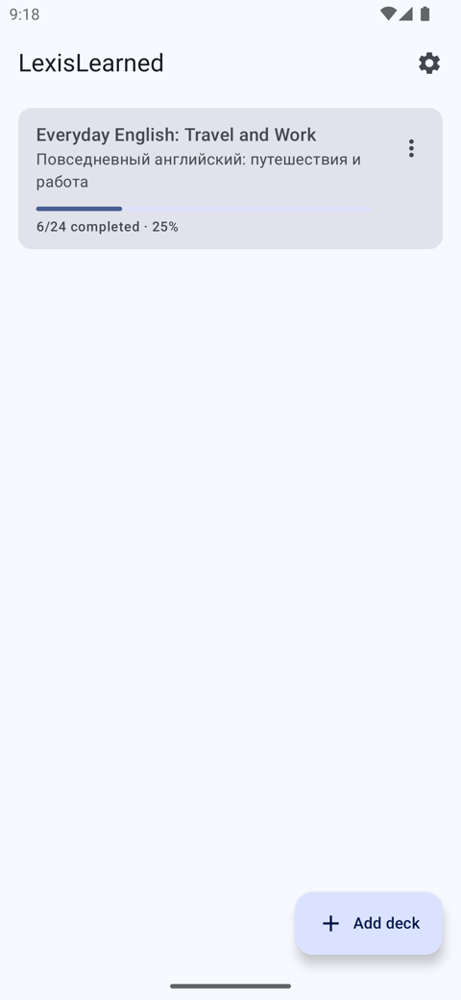
  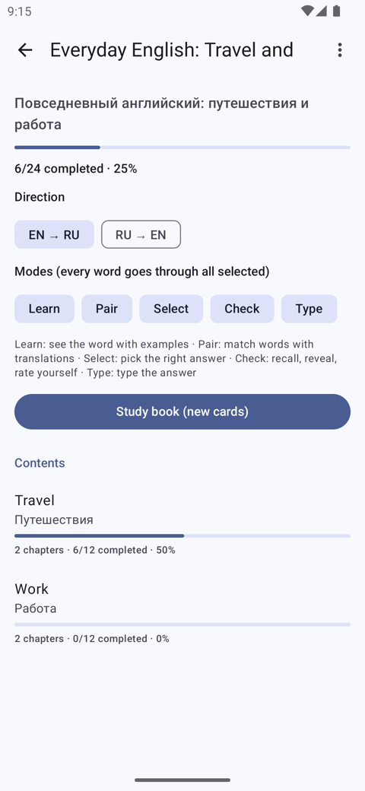
  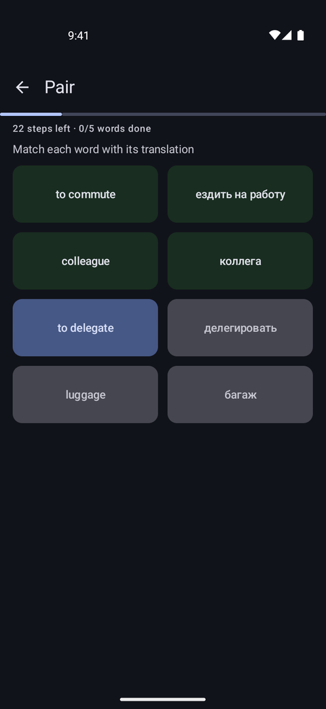
  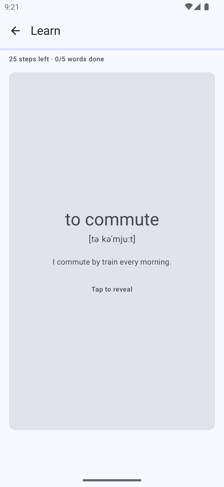
</p>

## Why LexisLearned

Reading in a language you are still learning is slow when every page hides a dozen unknown words. LexisLearned reverses the order: study a chapter's vocabulary first, then read the chapter.

- **Decks mirror the book.** A book can have parts (or novels, in an omnibus), which have chapters, which have words. Progress is shown at every level and rolls up to the book.
- **Every word, every mode.** A study session takes each word through all the modes you selected, not just one, and a word counts as learned only after the number of sessions you choose.
- **Bring your own decks.** Import LexisLearned `.lexis` files, or generate a deck from an EPUB with an AI model of your choice, using your own API key.

## Features

- **Five study modes**, each usable in both directions (foreign to native or the other way round):
  - **Learn**: flip the card and see the word, its transcription and example sentences.
  - **Pair**: match words with their translations. The board is topped up only with words you have studied before, never with ones you have not met.
  - **Select**: pick the right answer from several.
  - **Check**: recall the answer, reveal it, rate yourself.
  - **Type**: type the answer, forgiving about case, accents and small typos. **I don't know** shows the answer and the example sentences, and still counts as a miss.
- **Configurable sessions**: cards and new cards per session, rounds, the size of the Pair board, the number of sessions needed to complete a word, and optional spaced repetition between sessions.
- **Book, part and chapter screens**, each with its own progress, study button and options. Progress can be reset for a word, a chapter, a part or a whole book.
- **Deck from EPUB**: reads the book's structure, lets you review it, then has Claude, OpenAI or any OpenAI-compatible server pick vocabulary above your level and write translations, transcriptions and original example sentences. The list of available models is loaded from the provider. The deck grows chapter by chapter while it is generated, so you can start studying early; a generation runs in the background (also with the screen off), can be paused and resumed, even after the app was restarted, and does not limit how many cards a chapter gets.
- **Levels A1 to C2**, each with a built-in prompt you can edit, reset, and extend with your own instructions.
- **Private by design**: decks and progress stay on your phone, and your API key is stored encrypted.
- **Export** decks as `.lexis`, with your progress.

## Install

### Recommended: Obtainium

The preferred way to install LexisLearned is with **[Obtainium](https://obtainium.imranr.dev)**, an open-source Android app that installs and updates apps straight from their GitHub releases. You get updates as soon as they are published, without an app store. Obtainium itself is available from its [GitHub releases](https://github.com/ImranR98/Obtainium/releases/latest) (also on F-Droid and IzzyOnDroid); its [documentation](https://wiki.obtainium.imranr.dev/) explains the rest.

1. Install Obtainium on your phone.
2. **Allow pre-releases (required for now).** Every LexisLearned release so far is marked as a *pre-release*, and Obtainium **ignores pre-releases by default**, so it would find nothing to install. Turn on **Include pre-releases by default** in Obtainium's settings, or switch on **Include prereleases** in the app-specific options on the Add App screen in the next step.
3. Add the app: [open LexisLearned in Obtainium](https://apps.obtainium.imranr.dev/redirect?r=obtainium://add/https://github.com/denlogv/LexisLearned) on your phone, or in Obtainium choose **Add App** and paste `https://github.com/denlogv/LexisLearned`.
4. Tap **Add**, then **Install**. Android may ask you to allow Obtainium to install apps ("Install unknown apps").

Obtainium then checks for new releases and offers the update.

### Manual install

1. Open the **[Releases](../../releases)** page and download `LexisLearned-release.apk` from the latest release.
2. On your phone, allow installing apps from your browser or file manager if Android asks ("Install unknown apps").
3. Open the APK and install it.

Requires **Android 8.0 or newer**. Releases are signed with the same key every time, so a newer version installs over an older one as an update, however you installed it.

Each release also has a SHA-256 checksum and a build provenance attestation; [docs/RELEASING.md](docs/RELEASING.md#verifying-a-download) shows how to verify your download.

## Getting started

### 1. Get a deck

Tap **Add deck** on the library screen.

- **Import file**: choose a LexisLearned `.lexis` file. To try the app right away, download the small demo deck [`samples/demo-everyday-english.lexis`](samples/demo-everyday-english.lexis) (24 everyday English words, in parts and chapters). Importing a deck again replaces its words but keeps your progress.
- **Create from EPUB (AI)**: see [Decks from an EPUB](#decks-from-an-epub).

### 2. Find your way around

**Library** (all decks) → **Book** → **Part** (only for books that have parts, such as an omnibus or a story collection) → **Chapter** → its words.

Each level shows a progress bar and a line such as `3/16 completed · 5 in progress · 33%`. *Completed* words have finished all the sessions they need; *in progress* words have done some. A part's or book's progress is the sum of what is below it.

<table>
  <tr>
    <td align="center"><br><sub>A book: progress, options, parts</sub></td>
    <td align="center">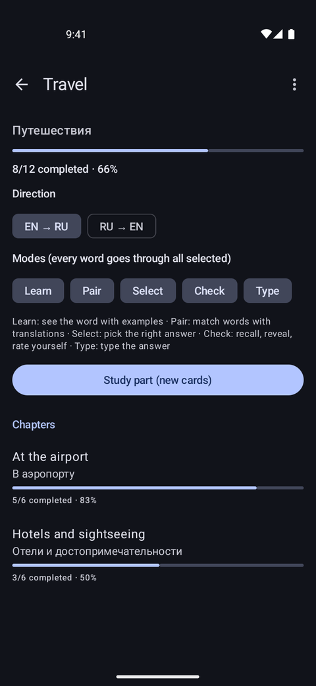<br><sub>A part and its chapters</sub></td>
    <td align="center">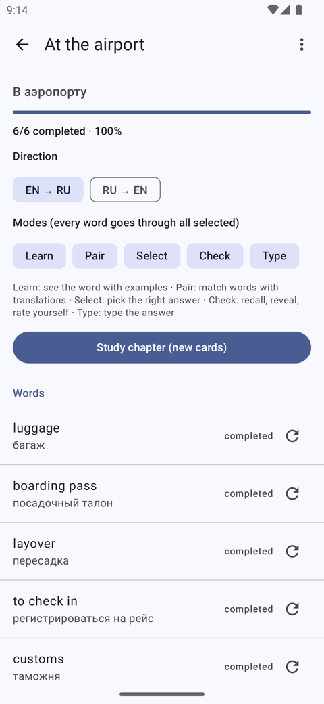<br><sub>A chapter and its words</sub></td>
  </tr>
</table>

### 3. Study

On a book, part or chapter screen choose the **direction** (for example EN → RU or RU → EN) and the **modes** you want, then tap **Study**. All five modes are on by default.

<table>
  <tr>
    <td align="center"><br><sub>Learn</sub></td>
    <td align="center"><br><sub>Pair</sub></td>
    <td align="center">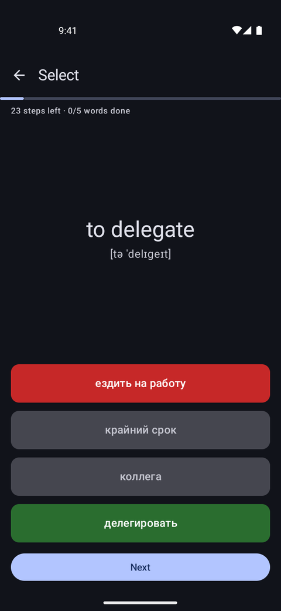<br><sub>Select</sub></td>
    <td align="center">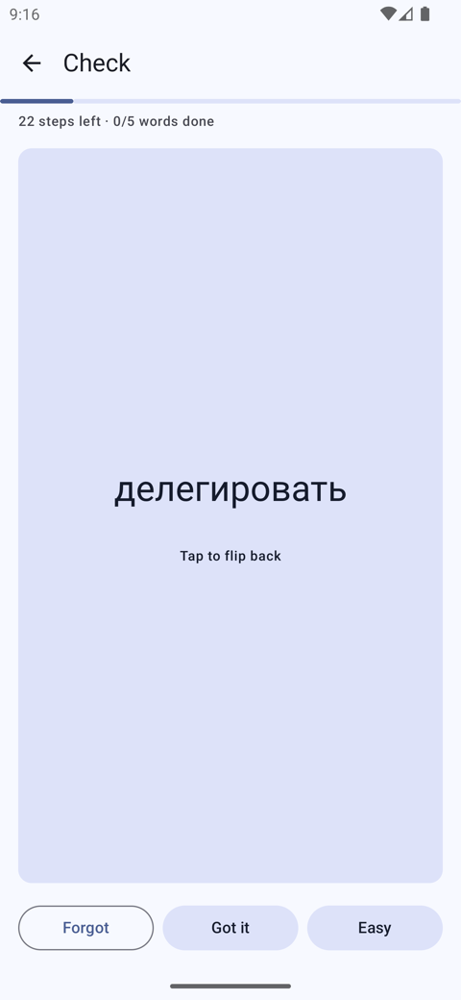<br><sub>Check</sub></td>
    <td align="center">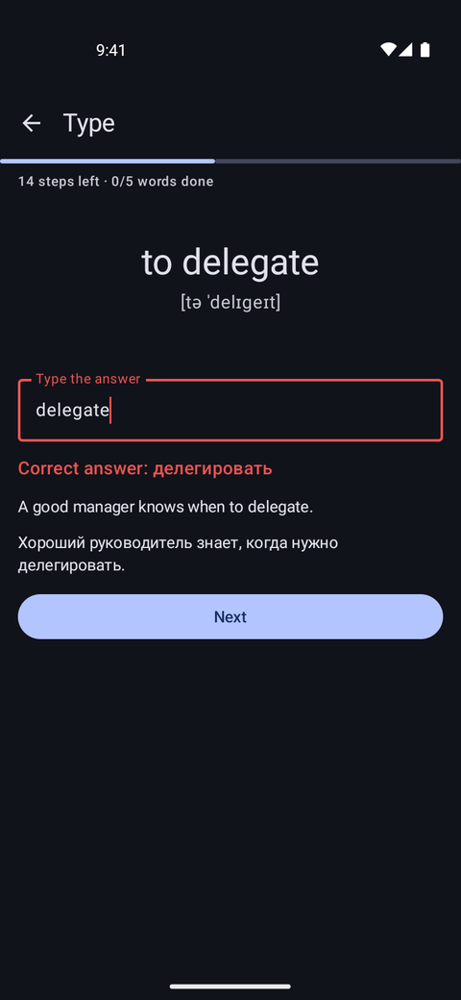<br><sub>Type</sub></td>
  </tr>
</table>

How a session works:

- It contains the words that are due first, then new words, up to the session size in Settings.
- **Every word goes through every selected mode.** Learn comes first, the other modes follow in random order, and the words are interleaved so you never see the same word twice in a row.
- A wrong answer repeats that step a little later, at most twice.
- A word's result is saved as soon as it has finished all its steps, so you can leave a session at any time without losing the words you already finished.
- In **Learn**, **I know it** skips a word you already know and counts it as fully known.
- After a session, a word comes back after a growing pause (spaced repetition), unless you turn that off. A word is **completed** after the number of successful sessions you configured (1 by default).

### 4. Reset progress

Use the **⋮** menu on a book, part or chapter screen to reset everything below it, or the refresh button next to a word to reset just that word. Only study progress is cleared, never the words themselves, and every reset asks for confirmation.

### 5. Settings

The settings screen is an overview of three pages, each with a one-line summary of what is chosen there: **Study sessions**, **Deck generation** and **Level and card prompt**. Tap one to open it; the settings are grouped into labelled cards on each page.

<table>
  <tr>
    <td align="center">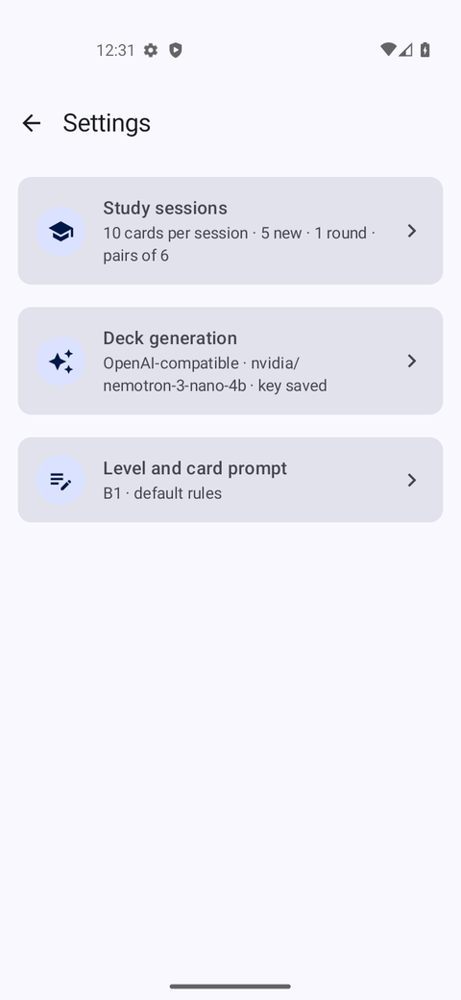<br><sub>The overview</sub></td>
    <td align="center">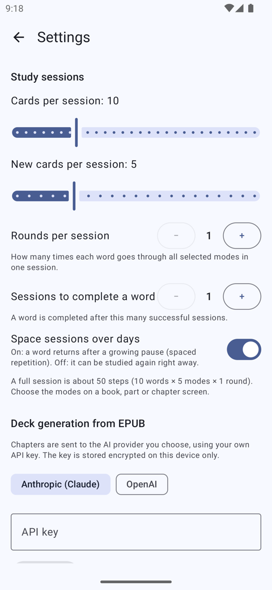<br><sub>Study sessions</sub></td>
  </tr>
</table>

| Setting | What it does |
| --- | --- |
| Cards per session | How many words one session contains. |
| New cards per session | How many never-studied words a session may add. |
| Rounds per session | How many times each word goes through all selected modes in one session. |
| Pairs per board | How many words are matched at once in Pair mode (3 to 12, default 6). A board is topped up to this size with words you have studied before, so it is smaller only while you have not studied enough words yet. |
| Sessions to complete a word | How many successful sessions make a word *completed*. |
| Space sessions over days | On: a word returns after a growing pause. Off: it can be studied again right away. |
| Provider, API key, model | Used to create decks from EPUBs. Choose **OAI-compatible** (any OpenAI-compatible server at your own address, for example LM Studio, Ollama or OpenRouter), **OpenAI** or **Claude**. The model list is loaded with your key. |
| Your language | The language cards are translated into (an ISO code such as `ru`, `de` or `es`). |
| Level and card rules | Your level (A1 to C2), editable rules for each level, and extra instructions. |

A full session takes roughly *cards × modes × rounds* steps, so a modest session size (the default is 10 words) keeps it comfortable.

## Decks from an EPUB

You need an API key from [Anthropic](https://console.anthropic.com/) or [OpenAI](https://platform.openai.com/), or the address and key of any server that speaks the OpenAI chat API (OpenRouter, Groq, Ollama, LM Studio and others). The key is stored encrypted on your phone and is sent only to the provider you chose. Usage is billed to your key, and the review screen shows an estimate before anything is sent.

1. In **Settings → Deck generation**, pick a provider, paste your key and tap **Save key**. The available models load; choose one. For a custom server pick **OAI-compatible**, enter its address including the version path (usually `/v1`, for example `https://openrouter.ai/api/v1`), save the key (any placeholder if the server needs none) and pick or type a model id. Plain `http://` addresses work too, but then your key and the book text travel unencrypted, so use them only on your own network.

   <table>
     <tr>
       <td align="center">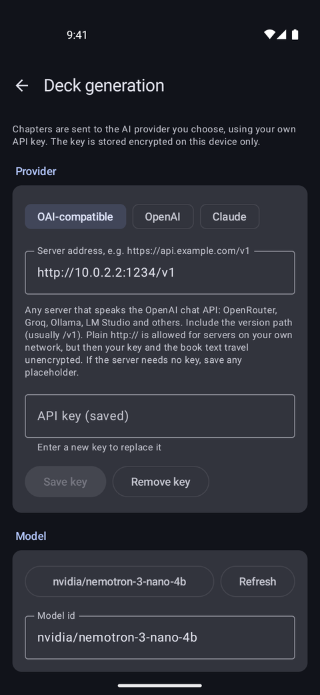<br><sub>Provider, key and model</sub></td>
     </tr>
   </table>

2. Tap **Add deck → Create from EPUB (AI)** and choose the book.
3. **Review the structure.** LexisLearned reads the book's table of contents and groups chapters into parts where the book has them (for example a story collection or an omnibus). Front and back matter such as contents, copyright pages, notes and licence text, as well as very short sections, are listed but unchecked; tick them if you want them. Check the book's language, choose your level, and untick sections you do not need. A chapter gets a card for every word above your level that the model finds in it, so chapters differ in how many cards they produce; there is no target or cap per chapter.

   <table>
     <tr>
       <td align="center">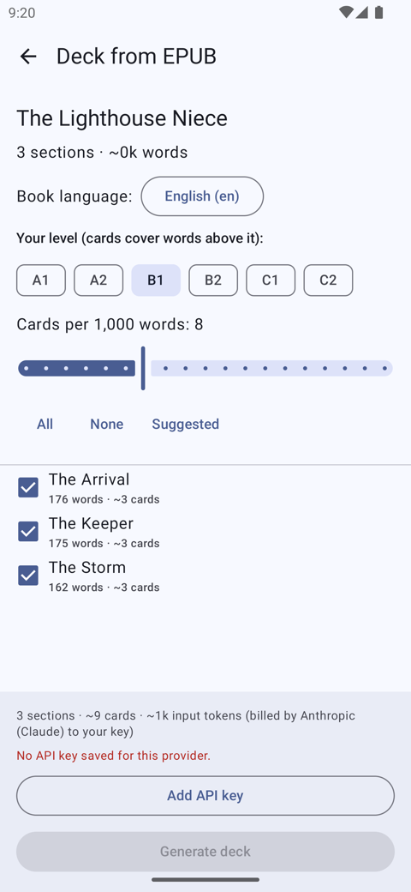<br><sub>Reviewing an EPUB before generating a deck</sub></td>
     </tr>
   </table>

4. Tap **Generate deck.** Sections are processed one at a time, and the deck grows as it goes: the book appears in your library with its first chapter, and each further chapter is added as soon as it is ready, so you can start studying before the whole book is done. Pressing it takes you back to the library, where a banner above the deck list follows the generation; its info button (the "i") explains what is going on, and the banner has two pause buttons: **Pause after section** (text) finishes the section in progress, because its request is paid for already, and then pauses; if none has started yet, it waits for the first one; **Pause now** (a pause icon) gives the request in flight up at once, and that section is done again on resume, so its cost is lost. Both keep every chapter that was finished. A paused generation stays paused, also after you close or restart the app: the book and what is done are kept on the phone, and the banner offers **Resume**, which does only the sections that are not in the deck yet and adds them to the same deck. If a section fails (a network drop, an overloaded provider, a rejected key), the rest carries on and the banner offers **Retry** for the sections that failed; requests that fail on the network or with a server error are retried automatically a few times first. **Choose sections** goes back to the review of the same book with the sections that are in the deck unticked, and **Discard the rest** (the cross in the corner of the banner, after a warning) forgets the book and removes the notification while the deck stays in your library. On the banner of a paused generation, **Choose sections** (a checklist icon) and **Resume** (a play icon) are icon buttons, and tapping the banner does nothing. When the deck is ready the banner says so; tapping it opens the deck and removes the banner, and the cross in its top right corner removes it without opening the deck (on a paused generation the same cross discards the rest). A failure stays on the banner, with the reason behind its info button, until you dismiss it. While a deck is generated, the app runs a foreground service with a notification showing the progress (with the same two pause buttons), so switching to another app or locking the screen does not stop it. On Android 13 and later the app asks once for the permission to show notifications; generation works without it, only the notification is hidden. The result is a normal deck.

   <table>
     <tr>
       <td align="center">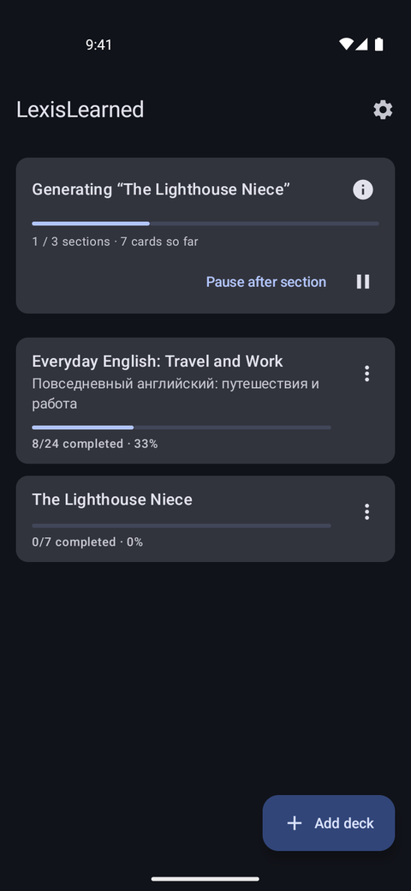<br><sub>A deck being generated in the background</sub></td>
       <td align="center">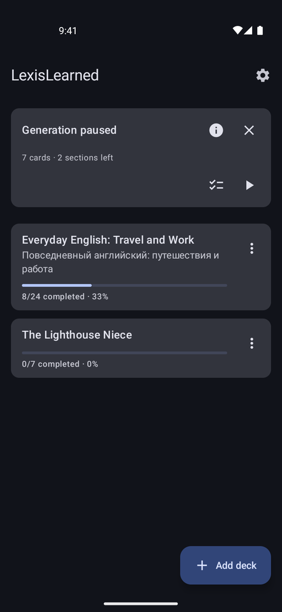<br><sub>A paused generation: choose sections or resume</sub></td>
     </tr>
   </table>


**Levels and the prompt.** Cards are chosen above the level you select, from A1 to C2, and each level has its own built-in rules. Under **Settings → Level and card prompt** you can edit the rules for the current level (the placeholders `{source_language}`, `{target_language}` and `{level}` are available), reset them to the default, and add extra instructions that apply to every level, for example "focus on legal vocabulary". The format of the model's reply is fixed by the app. It is best to keep the default rule that example sentences must not come from the book itself.

<table>
  <tr>
    <td align="center">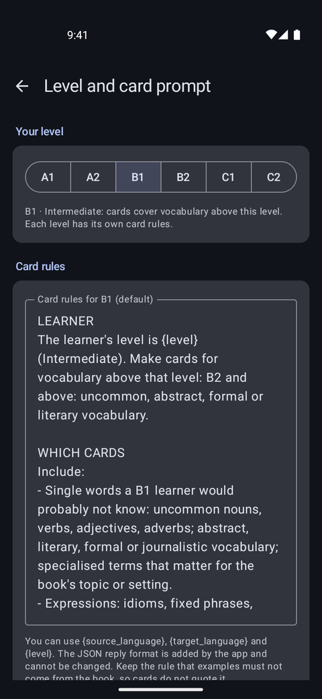<br><sub>Level and editable card prompt</sub></td>
  </tr>
</table>

For a cheap first try, use [`samples/lighthouse-sample.epub`](samples/lighthouse-sample.epub), a very short original story.

Please respect copyright: use books you have the right to use, and do not share decks generated from books you do not own.

## File formats

- **`.lexis`** is LexisLearned's own format: versioned JSON with the deck, its parts and chapters, every card and, optionally, your study progress. Use it for backups and for moving a deck to another phone.

Other formats can be added by implementing the `DeckFormat` interface; see [CONTRIBUTING.md](CONTRIBUTING.md).

## Privacy

- Decks, progress and settings are stored only on your device.
- The app uses the internet only to contact the AI provider or server you configured. Cleartext (`http://`) traffic is allowed because custom servers are often local. Generating a deck sends the text of the sections you selected to that provider. There is no analytics and no account.
- The API key is stored encrypted with a key held in the Android Keystore.
- While a deck is generated, and until you resume or discard a paused one, a copy of the EPUB you picked is kept in the app's private storage.
- The permissions are internet access, a foreground service (and a wake lock, so generation goes on with the screen off) and notifications.
- App backup is disabled, so the encrypted key is never copied to cloud backups.

## Building from source

You need JDK 17 to 21 (CI builds with 21) and the Android SDK. Newer JDKs may fail: JDK 27 does not build the `detekt-rules` module.

```bash
git clone <this repository>
cd LexisLearned
./gradlew testDebugUnitTest assembleDebug
```

The debug APK is written to `app/build/outputs/apk/debug/`. See [CONTRIBUTING.md](CONTRIBUTING.md) for the project layout and how to contribute, [docs/RELEASING.md](docs/RELEASING.md) for how releases are built and signed, and the [AI-assisted development](CONTRIBUTING.md#ai-assisted-development) section for how AI agents are used to develop this app and what keeps that honest.

## Known limitations

- No text-to-speech, cloud sync, or import of other flashcard formats yet.
- Vocabulary quality when generating a deck depends on the model and the level you choose; very small models, such as a few billion parameters run locally, often get translations and example sentences wrong.
- Release APKs are not minified yet, so they are larger than they need to be.

## License

LexisLearned is free software, licensed under the [GNU General Public License, version 3](LICENSE) (GPL-3.0-only). You may use, study, change and share it under those terms; changed versions you distribute must be offered under the same license.
